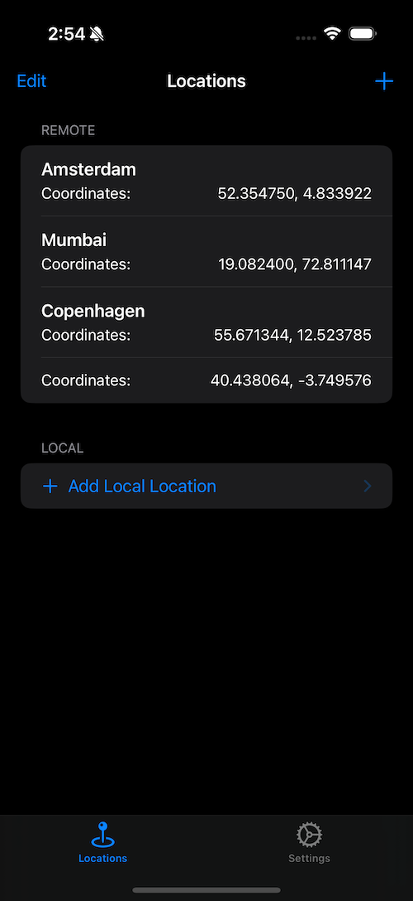
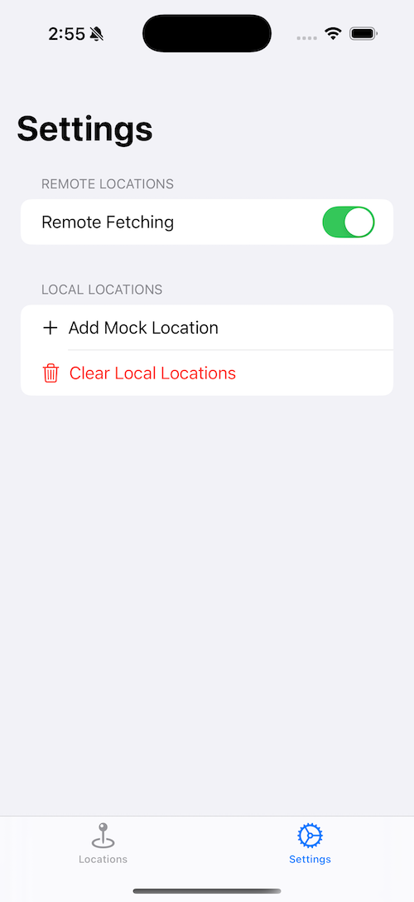
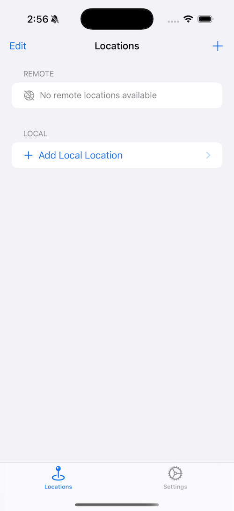
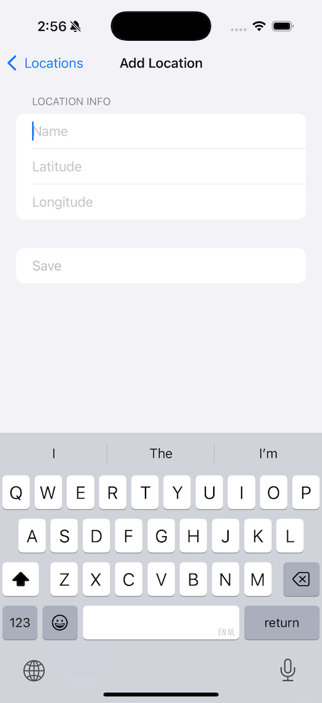
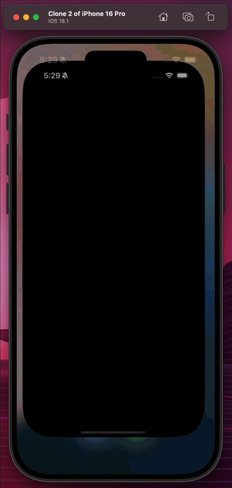

# WikiLocation

WikiLocation is a mini iOS application written in Swift, using SwiftUI and latest swift features to accompany Wikipedia Mobile Application.


Users can fetch a list of predefined locations from a remote server (currently Github), add location to their list and by tapping on each location, Wikipedia app opens and shows the selected location alongside nearest Wikipedia article.

For this feature to work you need a slightly modified version of Wikipedia which you can clone from here: https://github.com/0xKayvan/wikipedia-ios

The url schema that supports this transition is an add-on to Wikipedia's current location scheme, (i.e. wikipedia://places/?latitude=52.29083&longitude=4.58333)

Manually entered locations in the app are persisted for the next app launch and the remote ones will be fetch on each run (or manually). User's can disable remote location fetching to preserve privacy.

## Features

The app uses multiple Swift frameworks including `Combine`, `SwiftUI` and `Foundation`. The application architecture is a hybrid child of MVVM and DDD. The choice was done to showcase my ability in architectural design and Swift language features and development and to allow development flexibility.

## Screenshots

   

## Development

To test this mini project simply clone the repo and open it preferably using Xcode 16.0 or later. By selecting the `WikiLocation` scheme, app can be built and ran on a device or simulator.

## Testing

The suit of tests in this project are built on top of `XCTest` framework, there are almost complete unit-test coverage and multiple simple and integrated scenario UITests.
There is a complete UI integration test. A sample recording of the that test:



### Important Note for Running Tests

To allow application's test suit to use mock objects, there is three environment variables in the `WikiLocation.xctestplan` file:

```plaintext
USE_MOCKS = true
FB_REFERENCE_IMAGE_DIR = $(SOURCE_ROOT)\/$(PROJECT_NAME)Tests\/ReferenceImages
IMAGE_DIFF_DIR = $(SOURCE_ROOT)\/$(PROJECT_NAME)Tests\/FailureDiffs
```

## What can be added

The app can be easily extended and be developed upon, some ideas could be:

- Preventing users from adding duplicate locations.
- Allowing users to use Map or their current location to add a new location and make the app more intuitive.
- Show small map of each location instead of coordinate
